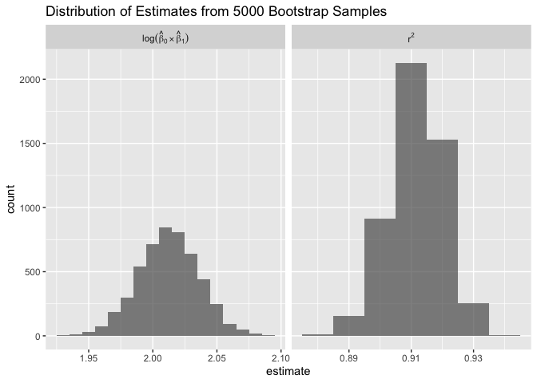
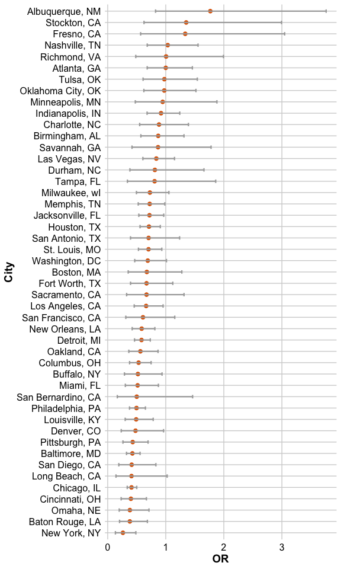

p8015_hw6_yl5839
================
Yuying Lu
2024-11-13

``` r
library(tidyverse)
library(glmnet)
theme_set(theme(legend.position = "bottom"))

options(
  ggplot2.continuous.colour = "viridis",
  ggplot2.continuous.fill = "viridis"
)

scale_colour_discrete = scale_colour_viridis_d
scale_fill_discrete = scale_fill_viridis_d
```

# Problem 1

``` r
weather_df = 
  rnoaa::meteo_pull_monitors(
    c("USW00094728"),
    var = c("PRCP", "TMIN", "TMAX"), 
    date_min = "2017-01-01",
    date_max = "2017-12-31") |> 
  mutate(
    name = recode(id, USW00094728 = "CentralPark_NY"),
    tmin = tmin / 10,
    tmax = tmax / 10) |> 
  select(name, id, everything())
```

``` r
set.seed(1000)
boot_fit = 
  weather_df |> 
  modelr::bootstrap(n = 5000) |> 
  mutate(
    models = map(strap, \(df) lm(tmax ~ tmin, data = df)),
    results = map(models, broom::tidy),
    glance = map(models, broom::glance))|> 
    select(-strap, -models)

log_beta = boot_fit |> 
  unnest(results) |> 
  select(.id, term, estimate) |> 
  pivot_wider(
    names_from = term,
    values_from = estimate
  ) |> 
  rename(hat_b0 = `(Intercept)`, 
         hat_b1 = tmin) |> 
  mutate(log_b = log(hat_b0 * hat_b1))
  
  
r_sq = boot_fit |> 
  unnest(glance) |> 
  select(.id, r.squared) 

est_df = left_join(log_beta, r_sq) |> 
  select(.id, log_b, r.squared) |> 
  pivot_longer(
    log_b:r.squared,
    names_to = 'term',
    values_to = 'estimate'
  )

labels <- as_labeller(c(
  r.squared = "r^2",
  log_b = "log(hat(beta)[0]%*%hat(beta)[1])"), label_parsed)

est_df |> 
  ggplot(aes(x = estimate)) +
  geom_histogram(binwidth = 0.01, alpha = 0.7) +
  labs(title = "Distribution of Estimates from 5000 Bootstrap Samples") +
  facet_grid(~term, labeller = labels, scales = "free_x")
```

<!-- -->

Using 5000 bootstrap samples, we produce the estimates of $r^2$ and
log($\hat{\beta}_0\times\hat{\beta}_1$) and plot the histogram figure to
illustrate the distribution of these two quantities. The shape of the
distribution is like a bell curve. Also we calculate and the mean value,
standard deviation, $2.5\%$ and $97.5\%$ quantiles of each term.

``` r
CI_df = 
  est_df |> 
  group_by(term) |> 
  summarize(
    lower_bound = round(quantile(estimate, 0.025),3),
    upper_bound = round(quantile(estimate, 0.975),3),
    mean = round(mean(estimate),3),
    sd = round(sd(estimate),3)
  ) |> 
  mutate(CI = paste0('(',lower_bound,', ',upper_bound,')')) 
```

For estimates of $r^2$, the mean value is 0.912, the standard deviation
is 0.009 and the $95\%$ confidence interval is (0.894, 0.927);

For estimates of log($\hat{\beta}_0\times\hat{\beta}_1$), the mean value
is 2.012, the standard deviation is 0.024 and the $95\%$ confidence
interval is (1.965, 2.058).

# Problem 2

## Data Importing and Wrangling

``` r
url = "https://raw.githubusercontent.com/washingtonpost/data-homicides/master/homicide-data.csv"
homi_df = read_csv(url)
homi_df = 
  homi_df |> 
  mutate(city_state = paste0(city, ', ', state),
         resolved = as.numeric(disposition == "Closed by arrest"),
         victim_age = as.numeric(victim_age)) |> 
  filter(!city_state %in% c('Dallas, TX', 'Phoenix, AZ', 'Kansas City, MO', 'Tulsa, AL ')) |> 
  filter(victim_race %in% c('White', 'Black')) |> 
  mutate(victim_race = fct_relevel(victim_race, "White")) |> 
  select(city_state, resolved, victim_age, victim_race, victim_sex) |> 
  drop_na()
```

## Apply `glm` to City of Baltimore, MD

``` r
set.seed(1000)
fit_glm = 
  homi_df |> 
  filter(city_state == 'Baltimore, MD') |> 
  glm(resolved ~ victim_age + victim_race + victim_sex, 
                 data = _, family = binomial())

summary_fit_glm =
  fit_glm|> 
  broom::tidy(conf.int = TRUE, exponentiate = TRUE)|>
  mutate(CI = paste0('(', round(conf.low,3),', ', round(conf.high,3),')')) |> 
  select(term, OR = estimate, CI)

summary_fit_glm |> 
  knitr::kable(digits = 3)
```

| term             |    OR | CI             |
|:-----------------|------:|:---------------|
| (Intercept)      | 3.164 | (1.998, 5.057) |
| victim_age       | 0.993 | (0.987, 1)     |
| victim_raceBlack | 0.431 | (0.305, 0.606) |
| victim_sexMale   | 0.426 | (0.324, 0.558) |

The estimate and $95\%$ confidence interval of the adjusted odds ratio
are 0.4255117 and (0.324, 0.558) for solving homicides comparing male
victims to female victims keeping all other variables fixed.

## Apply `glm` to All Cities

Noticed that `Tulsa, AL` only has one value for the outcome `resolved`,
so we should exclude this city before applying the `glm` to all the
cities.

``` r
summary_cities = 
  homi_df |>  
  nest(data = resolved:victim_sex) |> 
  mutate(mean_resolved = map_dbl(data, \(df) mean(df$resolved))) |> 
  filter(!mean_resolved %in% c(1,0)) |> 
  mutate(
    model = map(data, \(df) glm(data = df, resolved ~ victim_age + victim_race + victim_sex,  family = binomial())),
    tidy_model = map(model, \(df) broom::tidy(df, conf.int = TRUE, exponentiate = TRUE))
  )  |> 
  unnest(tidy_model) |>                
  filter(term == "victim_sexMale") |> 
  select(city_state, OR = estimate, conf.low, conf.high) |> 
  mutate(city_state = fct_reorder(city_state, OR))

summary_cities |> 
  knitr::kable(digits = 3)
```

| city_state         |    OR | conf.low | conf.high |
|:-------------------|------:|---------:|----------:|
| Albuquerque, NM    | 1.767 |    0.825 |     3.762 |
| Atlanta, GA        | 1.000 |    0.680 |     1.458 |
| Baltimore, MD      | 0.426 |    0.324 |     0.558 |
| Baton Rouge, LA    | 0.381 |    0.204 |     0.684 |
| Birmingham, AL     | 0.870 |    0.571 |     1.314 |
| Boston, MA         | 0.674 |    0.353 |     1.277 |
| Buffalo, NY        | 0.521 |    0.288 |     0.936 |
| Charlotte, NC      | 0.884 |    0.551 |     1.391 |
| Chicago, IL        | 0.410 |    0.336 |     0.501 |
| Cincinnati, OH     | 0.400 |    0.231 |     0.667 |
| Columbus, OH       | 0.532 |    0.377 |     0.748 |
| Denver, CO         | 0.479 |    0.233 |     0.962 |
| Detroit, MI        | 0.582 |    0.462 |     0.734 |
| Durham, NC         | 0.812 |    0.382 |     1.658 |
| Fort Worth, TX     | 0.669 |    0.394 |     1.121 |
| Fresno, CA         | 1.335 |    0.567 |     3.048 |
| Houston, TX        | 0.711 |    0.557 |     0.906 |
| Indianapolis, IN   | 0.919 |    0.678 |     1.241 |
| Jacksonville, FL   | 0.720 |    0.536 |     0.965 |
| Las Vegas, NV      | 0.837 |    0.606 |     1.151 |
| Long Beach, CA     | 0.410 |    0.143 |     1.024 |
| Los Angeles, CA    | 0.662 |    0.457 |     0.954 |
| Louisville, KY     | 0.491 |    0.301 |     0.784 |
| Memphis, TN        | 0.723 |    0.526 |     0.984 |
| Miami, FL          | 0.515 |    0.304 |     0.873 |
| Milwaukee, wI      | 0.727 |    0.495 |     1.054 |
| Minneapolis, MN    | 0.947 |    0.476 |     1.881 |
| Nashville, TN      | 1.034 |    0.681 |     1.556 |
| New Orleans, LA    | 0.585 |    0.422 |     0.812 |
| New York, NY       | 0.262 |    0.133 |     0.485 |
| Oakland, CA        | 0.563 |    0.364 |     0.867 |
| Oklahoma City, OK  | 0.974 |    0.623 |     1.520 |
| Omaha, NE          | 0.382 |    0.199 |     0.711 |
| Philadelphia, PA   | 0.496 |    0.376 |     0.650 |
| Pittsburgh, PA     | 0.431 |    0.263 |     0.696 |
| Richmond, VA       | 1.006 |    0.483 |     1.994 |
| San Antonio, TX    | 0.705 |    0.393 |     1.238 |
| Sacramento, CA     | 0.669 |    0.326 |     1.314 |
| Savannah, GA       | 0.867 |    0.419 |     1.780 |
| San Bernardino, CA | 0.500 |    0.166 |     1.462 |
| San Diego, CA      | 0.413 |    0.191 |     0.830 |
| San Francisco, CA  | 0.608 |    0.312 |     1.155 |
| St. Louis, MO      | 0.703 |    0.530 |     0.932 |
| Stockton, CA       | 1.352 |    0.626 |     2.994 |
| Tampa, FL          | 0.808 |    0.340 |     1.860 |
| Tulsa, OK          | 0.976 |    0.609 |     1.544 |
| Washington, DC     | 0.690 |    0.465 |     1.012 |

## Plot

``` r
summary_cities |> 
  ggplot(aes(x = city_state, y = OR)) +
  geom_point(size = 2, color = "#DF6604") +
  geom_errorbar(aes(ymin = conf.low, ymax = conf.high), width = 0.3, color = "darkgray", size = 0.8) +
  coord_flip() +
  labs(
    x = "City",
    y = "OR"
  ) +
  theme_minimal() + 
  theme(
    plot.title = element_text(hjust = 0.5, face = "bold", size = 18),  
    axis.title.x = element_text(size = 14, face = "bold"),  
    axis.title.y = element_text(size = 14, face = "bold"),  
    axis.text.x = element_text(size = 12, color = "black"), 
    axis.text.y = element_text(size = 12, color = "black"), 
    panel.grid.major = element_line(color = "lightgray", size = 0.5),  
    panel.grid.minor = element_blank()  
  ) 
```

<!-- -->

**Comment:**

``` r
mean_df = 
  summary_cities |> 
  filter(OR > 1)

mean_df
```

    ## # A tibble: 6 × 4
    ##   city_state         OR conf.low conf.high
    ##   <fct>           <dbl>    <dbl>     <dbl>
    ## 1 Albuquerque, NM  1.77    0.825      3.76
    ## 2 Atlanta, GA      1.00    0.680      1.46
    ## 3 Fresno, CA       1.34    0.567      3.05
    ## 4 Nashville, TN    1.03    0.681      1.56
    ## 5 Richmond, VA     1.01    0.483      1.99
    ## 6 Stockton, CA     1.35    0.626      2.99

- There are 6 cities has the estimated OR larger than 1

``` r
reject_null = 
  summary_cities |> 
  filter(conf.high < 1|conf.low > 1)

reject_null
```

    ## # A tibble: 22 × 4
    ##    city_state          OR conf.low conf.high
    ##    <fct>            <dbl>    <dbl>     <dbl>
    ##  1 Baltimore, MD    0.426    0.324     0.558
    ##  2 Baton Rouge, LA  0.381    0.204     0.684
    ##  3 Buffalo, NY      0.521    0.288     0.936
    ##  4 Chicago, IL      0.410    0.336     0.501
    ##  5 Cincinnati, OH   0.400    0.231     0.667
    ##  6 Columbus, OH     0.532    0.377     0.748
    ##  7 Denver, CO       0.479    0.233     0.962
    ##  8 Detroit, MI      0.582    0.462     0.734
    ##  9 Houston, TX      0.711    0.557     0.906
    ## 10 Jacksonville, FL 0.720    0.536     0.965
    ## # ℹ 12 more rows

- There are 22 cities whose $95\%$ confidence interval for OR doesn’t
  contain the null value 1. For these cities, we notice that the $95\%$
  confidence is smaller than 1, so we have $95\%$ confidence to say the
  solving homicides of male victims is significantly less than that of
  female victims.

# Problem 3

## Load and Clean the Data

``` r
bwt_df = 
  read_csv("data/birthweight.csv") |> 
  janitor::clean_names() |>
  mutate(
    babysex = 
        case_match(babysex,
            1 ~ "male",
            2 ~ "female"
        ),
    babysex = fct_infreq(babysex),
    frace = 
        case_match(frace,
            1 ~ "white",
            2 ~ "black", 
            3 ~ "asian", 
            4 ~ "puerto rican", 
            8 ~ "other"),
    frace = fct_infreq(frace),
    mrace = 
        case_match(mrace,
            1 ~ "white",
            2 ~ "black", 
            3 ~ "asian", 
            4 ~ "puerto rican",
            8 ~ "other"),
    mrace = fct_infreq(mrace),
    malform = as.logical(malform)) |> 
  sample_n(200)
```
